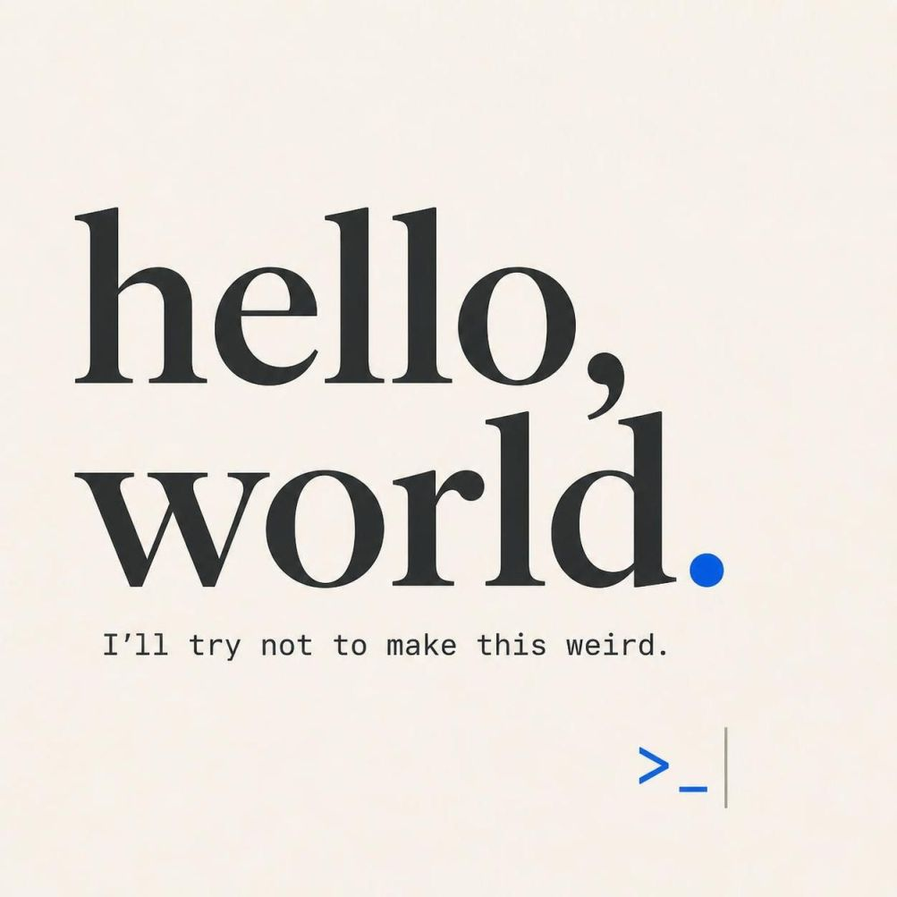

This is my first post on my new Hugo website! Testing this out before fully migrating from [WordPress](https://wordpress.com/). :)

The switch isn't exactly straightforward. I spent some time wrestling with migration tools, but nothing clicked quite right. So here I am — building content slowly, learning as I go, and as i failed to import stuff automagically, I'm planning to do it manually if and when the time feels right.

Why ditching [WordPress](https://wordpress.com/) after more than a decade?

**A few quick notes on why this change:**
- Hugo offers speed and simplicity I couldn't find elsewhere ⚡
- [Markdown](https://en.wikipedia.org/wiki/Markdown) + [plain text](https://en.wikipedia.org/wiki/Plain_text) = workflow fits how I think and write
- Full control without platform lock-in: can easily transfer my content from platform to platform
- It just works, which matters more than flashy features

This space will evolve as I do. Expect posts about [GitHub](https://github.com/opedromandrade) projects, occasional radio experiments, photography and whatever else catches my jazz.
The goal is to keep things organized, honest, and actually sustainable long-term. Also this theme might not be definitive. So keep an eye here from time to time.

Feedback and tips are always welcome 👋

Thanks for stopping by.